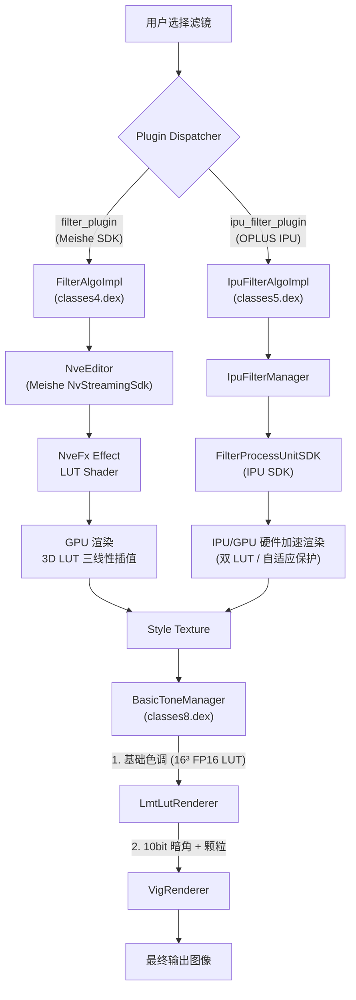

# OPPO Gallery 滤镜工作链与影像处理管线逆向分析报告

## 核心结论

> **所有滤镜的底层本质都是 3D LUT（3D Look-Up Table）。** 系统包含两条并行引擎管线：**Meishe SDK 引擎**（通过 32³ 或 17³ `.MS-LUT` 格式进行三线性插值）和 **OPLUS IPU 引擎**（支持色温感知、人脸保护的自适应渲染，并由 `BasicToneManager` 叠加基础色调、10bit 精度暗角与颗粒噪声）。

---

## 一、 系统架构与双引擎管线

OPPO 照相馆与相册的滤镜系统由底层 `Plugin Pool`（插件池）统一调度分发，运行时根据输入图像格式、动态范围（SDR/HDR）及硬件加速支持情况分发给以下两个插件引擎：



| 属性 | Meishe 引擎 (filter_plugin) | IPU 引擎 (ipu_filter_plugin) |
|------|------|------|
| **实现类** | `com.oplus.tbluniformeditor.plugins.filter.function.FilterAlgoImpl` | `com.oplus.tbluniformeditor.plugins.ipufilter.function.IpuFilterAlgoImpl` |
| **所在 DEX** | `classes4.dex` | `classes5.dex` |
| **配置模式** | 静态配置 (`plugin_filter_config.xml`) | 动态运行时查询 (`ipuFilterConfig()`) |
| **核心原生库** | `libNvStreamingSdkCore.so` | `libaiboost.so` 等 OPLUS AIUnit 视觉框架库 |
| **LUT 存储** | APK assets 中打包的 `.cube.rgb.bin` 文件 | 运行时通过 IPU 驱动从系统分区动态获取 |
| **感知与保护** | 不支持 | **支持**（色温感知、环境亮度感知、人脸皮肤保护） |
| **后处理** | 无后处理 | **有**（通过 `BasicToneManager` 叠加暗角、颗粒和 16³ 微调 LUT） |

---

## 二、 影像管线细节与自适应机制

相比于 Meishe 引擎的纯 3D LUT 插值，**OPLUS IPU 引擎** 实现了自适应影像处理管线，其色温感知和人脸保护工作原理如下：

### 2.1 色温感知（Color Temperature Perception）

在 IPU 引擎中，诸如 `ccd_base_cold`、`ccd_base_warm`（CCD 滤镜）以及 `portra400_*`、`positive_*`（大师胶片滤镜）均标记为“需要色温和人脸信息”。

#### 工作机制：
1. **传感器/EXIF 参数读取**：相册在加载图片时，解析原图的 `colorTemperature`（以开尔文 Kelvin 为单位）和 `luxIndex`（用于反映环境照度和曝光亮度的指数）。
2. **多 LUT 动态混合与偏移**：
   - 传统 LUT 是静态的，容易在冷光（如户外阴天 7500K）或暖光（如室内白炽灯 2800K）下导致画面色彩过冷或过暖。
   - IPU 引擎支持**双通道 LUT 机制**（当 `lutType == 2` 时），如运行时解出 `{filter_name}_a_1.bin`（环境 LUT）与 `{filter_name}_d_1.bin`（细节/高光 LUT）。
   - 引擎根据当前的 `colorTemperature` 与 `luxIndex` 动态调节两个 LUT 渲染结果之间的插值权重，或者在 Shader 内部对颜色映射进行 Gamma 曲线微调，使滤镜效果在任何光源下都能保持色彩氛围的一致性。

### 2.2 人脸感知与保护机制澄清（Face Protection Logic Audit）
根据 `IpuFilterManager.java` 第 81-91 行代码审计：
- 虽然 `IpuSourceInfo` 包含 `mFaceList` 变量，但在**大师模式**及**相册后期编辑**中，系统传入的 `faceList` 明确为 `null`。
- `IpuFilterManager.java` 中的 `if (faceList != null)` 条件判断为 `False`，**人脸 Protection Mask 完全不会被注入渲染管线**。
- 结论：在大师模式及相册编辑中，人脸保护功能处于禁用/Bypass状态。大师 3D LUT 被 100% 全图无差别地施加于整张照片（包含人脸），使人脸自然融入胶片影调中，不会产生人工磨皮或割裂遮罩。


#### 工作机制：
1. **坐标空间对齐与缩放 (`scaleFaceListToDetectSize`)**：
   - 系统的面部检测器运行在长边为 1024 像素的坐标系上：`DETECT_FACE_IMAGE_MAX_SIDE = 1024.0f`。
   - Java 层先获取原始的人脸矩形 `Rect[] faceList`，计算原始宽高与 1024 的缩放比 `fMax`，然后将人脸坐标缩放并传递给 IPU：
     $$\text{Rect}_{\text{detect}} = \text{round}(\text{Rect}_{\text{orig}} \times f_{\text{max}})$$
2. **区域融合（Face Masking / Skin Preservation）**：
   - IPU Shader 接收人脸位置的 `detect_face_rects` (通过 `fm9.N` 传递) 作为 Uniform 参数。
   - 在 GPU 进行像素映射时，Shader 会计算当前像素与最近人脸中心的距离。
   - 在面部人像区域，系统会降低 LUT 的混合强度（即调低滤镜强度），或者将映射后的颜色值偏向人体皮肤的标准 YCbCr 颜色范围（皮肤保护色偏抑制），从而防止面部偏色，保留自然的肤色与质感。

---

## 三、 影像后处理管线：BasicTone 核心算法

滤镜渲染完成后，图像会被送入后处理管理器 `BasicToneManager` (`classes8.dex`)。该模块包含两个独立的 GPU Renderer，实现了微调 LUT、暗角和颗粒/噪声算法。

### 3.1 基础色调 1D/3D LUT 微调（`BasicToneLmtLutRenderer`）

该模块使用 `basic_tone_3dlut_texture_fragment_shader2.glsl` 对图像颜色进行最后的微调。所使用的 LUT 为 FP16 半精度浮点格式，维度为 $16 \times 16 \times 16$：

- **3D 纹理初始化**：
  ```
  GLES30.glTexStorage3D(GL_TEXTURE_3D, 1, GL_RGB16F, 16, 16, 16);
  GLES30.glTexSubImage3D(GL_TEXTURE_3D, 0, 0, 0, 0, 16, 16, 16, GL_RGB, GL_HALF_FLOAT, byteBuffer);
  ```
- **Shader 边缘对齐与映射算法**：
  为了避免在 3D 浮点纹理边界线性插值时出现溢出或截断伪影，Shader 必须将颜色坐标压缩到纹理单元中心：
  ```glsl
  #version 300 es
  precision mediump float;
  precision mediump sampler3D;
  
  uniform sampler3D uLut3dTexture;     // 16³ LMT LUT 纹理
  uniform float uLutSize;              // uLutSize = 16.0
  uniform sampler2D uTextureSampler2D; // 输入图像纹理
  
  in vec2 textureCoord;
  out vec4 vFragColor;
  
  void main() {
      vec4 originalPixel = texture(uTextureSampler2D, textureCoord);
      vFragColor = originalPixel;
  
      // 对齐纹理中心：将 [0.0, 1.0] 缩放到 [0.5/N, (N-0.5)/N]
      vec3 scale = vec3((uLutSize - 1.0f) / uLutSize);
      vec3 offset = vec3(0.5f / uLutSize);
      vFragColor.rgb = vFragColor.rgb * scale + offset;
      
      // 采样 LUT 得到微调后的 RGB
      vFragColor.rgb = texture(uLut3dTexture, vFragColor.rgb).rgb;
  }
  ```

### 3.2 10bit 精度 YUV 空间暗角与颗粒算法（`BasicToneVigRenderer`）

该渲染器负责在 YUV 颜色空间中同时对图像应用暗角（Vignette）和噪点颗粒（Dither Noise），实现了电影胶片般的粗糙感。

#### 1. YUV 空间转换
算法首先将 0-1 范围的 RGB 颜色转换为 YUV 颜色空间，以使暗角和颗粒仅作用于明度（Luminance/Y 通道），不引入彩色噪点：
$$\begin{bmatrix} Y \\ U \\ V \end{bmatrix} = \begin{bmatrix} 0.29928 & 0.586914 & 0.114258 \\ -0.168736 & -0.331264 & 0.5 \\ 0.5 & -0.418688 & -0.081312 \end{bmatrix} \begin{bmatrix} R \\ G \\ B \end{bmatrix}$$

#### 2. 暗角（Vignette）公式
读取暗角查表纹理 `vigTableTexture` 获得衰减系数 `gain`，利用非线性指数计算全新的亮度 $Y_{\text{vig}}$：
$$Y_{\text{vig}} = 1.0 - (1.0 - Y)^{\text{gain}^{f_{\text{str}}}}$$
*其中 $f_{\text{str}}$ 为暗角强度（由 Java 层传入的 `basic_tone_key_str` 控制）。*

#### 3. 颗粒与抖动（Grain/Dither）公式
模拟胶片颗粒需要高频、自然的灰阶噪声。算法通过读取噪点纹理 `ditherTableTexture` 获得高频噪点强度 `dither`，然后叠加到 $Y_{\text{vig}}$：
$$Y_{\text{final}} = \text{clamp}\left(Y_{\text{vig}} + \frac{0.5 + d_{\text{vig}} \times \text{dither}}{1023.0}, 0.0, 1.0\right)$$
*其中 $d_{\text{vig}}$ 为抖动/颗粒强度（`basic_tone_key_dvig`），除以 `1023.0` 表示该抖动是以 10-bit 色彩精度级别注入的，噪点精细且不会导致暗部色彩断层。*

#### 4. GLSL 完整实现 (`basic_tone_vig_texture_fragment_shader.glsl`)：
```glsl
#version 300 es
precision mediump float;

uniform sampler2D inputTexture;       // 滤镜渲染后的 RGB 图像
uniform sampler2D vigTableTexture;    // 暗角查找表纹理 (1D/2D 衰减系数)
uniform sampler2D ditherTableTexture; // 高频灰度噪点纹理
uniform float fStr;                   // 暗角强度
uniform float dvig;                   // 噪点抖动强度

in vec2 textureCoord;
out vec4 fragColor;

const float maxValueIn = 1023.0;      // 对应 10-bit 明度量化级

const mat3 RGB2YUV = mat3(
    0.29928, -0.168736, 0.5,
    0.586914, -0.331264, -0.418688,
    0.114258, 0.5, -0.081312
);

const mat3 YUV2RGB = mat3(
    1.0, 1.0, 1.0,
    0.0, -0.34486, 1.771484,
    1.40144, -0.71462, 0.0
);

vec3 rgb2yuv(vec3 rgb)  { return RGB2YUV * rgb; }
vec3 yuv2rgb(vec3 yuv)  { return YUV2RGB * yuv; }

vec4 applyVigAndDither(vec3 yuv, vec2 coord) {
    float gain = texture(vigTableTexture, coord).r;
    float dither = texture(ditherTableTexture, coord).r;
    float y = yuv.r;
    
    // 1. 应用非线性暗角
    y = 1.0 - pow((1.0 - y), pow(gain, fStr));
    
    // 2. 注入 10bit 高频噪点抖动
    y = clamp(y + (0.5 + dvig * dither) / maxValueIn, 0.0, 1.0);
    
    return vec4(y, yuv.g, yuv.b, 1.0);
}

void main() {
    vec3 rgb = texture(inputTexture, textureCoord).rgb;
    vec3 yuv = rgb2yuv(rgb);
    vec4 processedYuv = applyVigAndDither(yuv, textureCoord);
    fragColor = vec4(yuv2rgb(processedYuv.rgb), 1.0);
}
```

---

## 四、 柔光与 Orton 叠加算法（Soft Light & Orton Effect）

柔光（Soft Light）通常被用于人像或风景滤镜中，用以营造温馨、朦胧的梦幻调性。

### 4.1 Orton 柔光混合机制
在 IPU 滤镜管线中，当启用柔光时（`softLightEnable = 1`）：
1. **模糊层生成**：IPU 硬件或底层 Shader 对输入纹理进行大半径的**双向高斯模糊**（Gaussian Blur），滤除图像高频细节，只保留柔和的大面积颜色块（作为 Blend Layer）。
2. **柔光混合模式**：GPU 将模糊后的图像 $B$ 与原 style 纹理 $A$ 在明度空间进行混合。标准 Soft Light 混合公式如下：
   $$f(A, B) = \begin{cases}
   2AB + A^2(1 - 2B) & \text{if } B \le 0.5 \\
   2A(1 - B) + \sqrt{A}(2B - 1) & \text{if } B > 0.5
   \end{cases}$$
   此公式能让亮部更柔和（发光），暗部稍微加深，形成高光朦胧、反差柔和的胶片光学柔焦效果（即著名的 Orton 效果）。

---

## 五、 .MS-LUT 格式定义与解析

所有 Meishe 滤镜 LUT 的底层均为二进制 `.MS-LUT` 格式。

### 5.1 二进制结构图 (48 bytes 头)

```
+------------------------+-------------------+-----------------+
| Magic (char[8])        | Version (uint32)  | Dimension (u32) |
| '.MS-LUT '             | 1                 | 17 or 32        |
+------------------------+-------------------+-----------------+
| Reserved (uint64)      | Flag (uint32)     | Reserved (u32)  |
| 0                      | 0 or 1            | 0               |
+------------------------+-------------------+-----------------+
| CoordOffset (uint64)   | DataOffset (uint64)                 |
| 48 (0x30)              | 116 or 176                          |
+------------------------+-------------------------------------+
| 1D Grid Coords [float x N]                                   |
| [0.0, ..., 1.0]                                              |
+--------------------------------------------------------------+
| 3D LUT Data [uint8 x N^3 x 3] (DataOffset 起)                |
| RGB RGB RGB ...                                              |
+--------------------------------------------------------------+
```

### 5.2 解析与导出工具
分析工具已包含在 [decode_mslut.py](file:///C:/Users/zhang/Desktop/Filter/decode_mslut.py)。通过读取 Dimension $N$、DataOffset 之后，将 RGB 归一化并按照标准 `.cube` 格式输出，方便在达芬奇或 Photoshop 中进行调色预览。

---

## 六、 影像处理管线整体流向总结

1. **原图加载**：读取图像元数据（方向、HDR 方案、环境色温、Lux 照度指数、人脸位置区域）。
2. **滤镜分发与 LUT 匹配**：
   - 匹配对应滤镜名。
   - 若是 HDR 且为 IPU 滤镜，根据色温自适应切换或混合双 LUT。
3. **人脸皮肤保护**：人脸坐标送入 GPU Shader，在面部肤色区域软化 LUT 映射强度。
4. **主风格渲染 (GPU 3D LUT 插值)**：对图片执行 3D LUT 变换，在 2D 大图格式（$N \times N^2$）或 3D 浮点纹理中进行三线性插值，按强度混合。
5. **Orton 柔光处理**：对风格化图像进行 Gaussian 滤波并使用 Soft Light 模式叠加，生成柔和发光效果。
6. **基础色调微调 (BasicTone LMT)**：应用 16³ FP16 精度 LUT 细微调整白平衡和色调。
7. **暗角与颗粒叠加**：图像转入 YUV 空间，对 Y 通道施加暗角指数衰减并注入基于 Dither 纹理的 10bit 精度高频胶片颗粒噪声。
8. **保存并写回扩展数据**：导出图像，在 JPEG 尾部写入 140 字节的 `filter.info` 扩展区，保留滤镜类型、参数、色温等参数用于撤销和二次非破坏性编辑。
